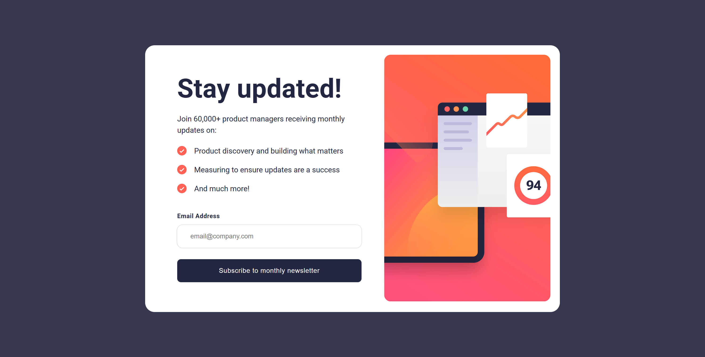
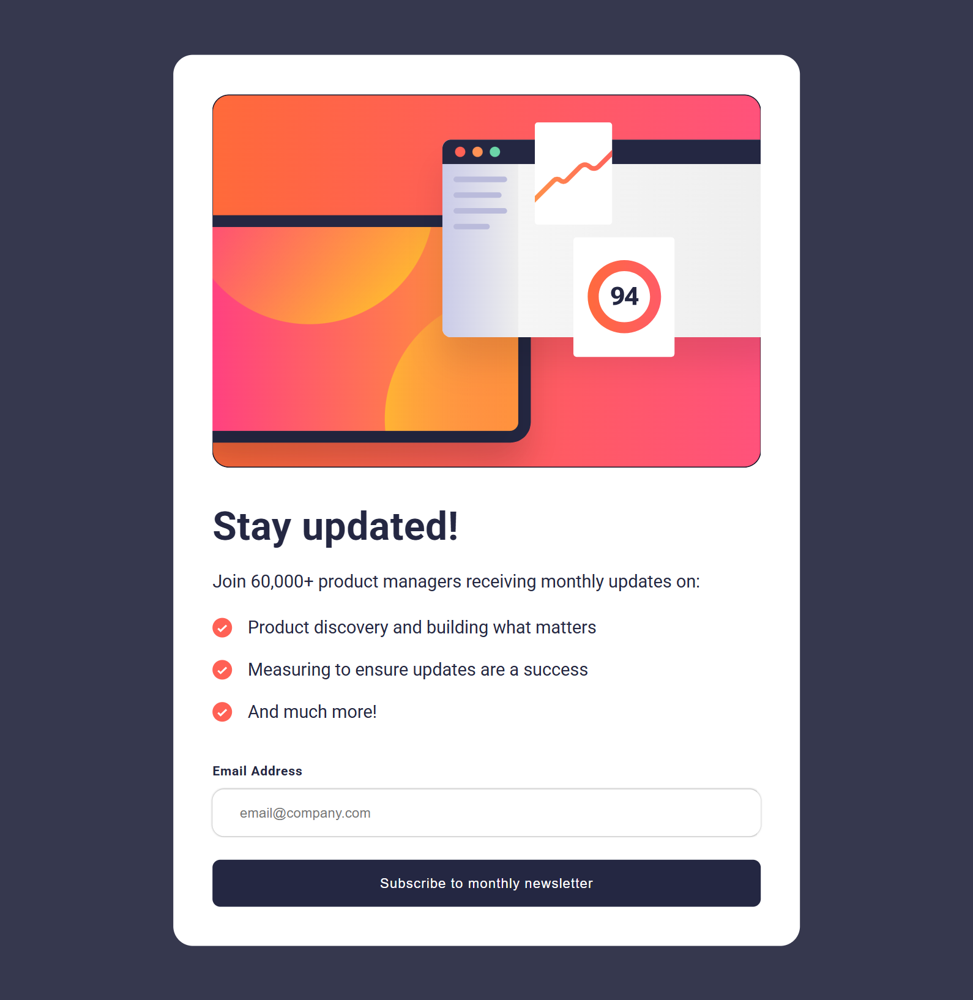
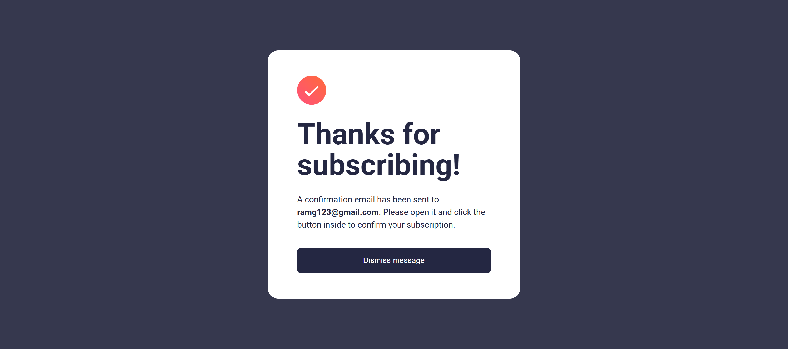

# Newsletter Signup Form

A responsive newsletter signup form component built with HTML, CSS, and vanilla JavaScript. This project features a modern, two-state design with form validation, success messaging, and beautiful responsive behavior that adapts seamlessly across all devices.

## Preview

The component displays an elegant newsletter signup interface featuring:

- Eye-catching illustration with responsive images
- Clean signup form with benefits list
- Real-time email validation with error handling
- Success confirmation screen with personalized message
- Smooth state transitions and animations
- Mobile-first responsive design

### Desktop Preview



### Tablet Preview



### Mobile Preview


### Success State Preview



## Features

- 🎨 Modern, clean card-based design
- 📱 Fully responsive across 4 breakpoints (Desktop, Small Laptop, Tablet, Mobile)
- ✅ Real-time email validation with regex pattern
- 🔄 Dynamic state management (Signup ↔ Success)
- 💫 Smooth CSS transitions and hover effects
- 🔤 Google Fonts integration (Roboto)
- ♿ Semantic HTML structure
- 🎯 Form validation with clear error messaging
- 📦 Lightweight vanilla JavaScript (no dependencies)
- 🖼️ Responsive image handling with `<picture>` element
- 🎨 Gradient button hover effects
- 📧 Email display in success message

## Technologies Used

- HTML5
- CSS3 (Flexbox)
- Vanilla JavaScript (ES6+)
- Google Fonts (Roboto)
- Regex for email validation

## Project Structure

```
project-root/
│
├── index.html          # Main HTML file
├── style.css           # Stylesheet
├── script.js           # JavaScript functionality
├── README.md           # Project Documentation
└── Images/
    ├── illustration-sign-up-desktop.svg  # Desktop illustration
    ├── illustration-sign-up-tablet.svg   # Tablet illustration
    ├── illustration-sign-up-mobile.svg   # Mobile illustration
    ├── icon-list.svg                     # Checkmark icon
    ├── icon-success.svg                  # Success checkmark
    └── screenshots/
        ├── desktop-preview.png           # Desktop screenshot
        ├── tablet-preview.png            # Tablet screenshot
        ├── mobile-preview.png            # Mobile screenshot
        └── success-preview.png           # Success state screenshot
```

## Installation

1. Clone or download this repository
2. Ensure all images are placed in the `Images` folder
3. Open `index.html` in your web browser

## Usage

The form validation works automatically:

1. User enters email address
2. Real-time validation on input change
3. Click "Subscribe to monthly newsletter" button
4. **Valid email**: Shows success screen with personalized message
5. **Invalid email**: Displays "Valid Email Required" error message
6. Click "Dismiss message" to return to form

No additional configuration required!

## Design Specifications

### Colors

#### Background & Cards

- **Page Background**: `hsl(235, 18%, 26%)` - Dark slate gray
- **Card Background**: `hsl(0, 0%, 100%)` - White
- **Button Default**: `hsl(234, 29%, 20%)` - Very dark desaturated blue
- **Button Hover**: `linear-gradient(to right, hsla(4, 100%, 67%, 0.6), hsl(4, 100%, 67%))` - Tomato gradient

#### Text Colors

- **Primary Text**: `hsl(234, 29%, 20%)` - Very dark desaturated blue
- **Error Message**: `hsl(4, 100%, 67%)` - Tomato red
- **Button Text**: `hsl(0, 0%, 100%)` - White

### Typography

- **Font Family**: Roboto (Google Fonts)
- **Base Font Size**: 16px
- **Signup Title**: 56px (5.6rem), weight: 700
- **Description**: 16px, line-height: 1.5
- **List Items**: 16px, line-height: 1.5
- **Input Label**: 13px, weight: 700
- **Button**: 14px, weight: 500
- **Success Title**: 56px, line-height: 1.05

### Layout

#### Desktop (>1060px)

- **Container Max Width**: 880px
- **Card Layout**: Horizontal (content left, image right)
- **Content Padding**: 48px (left) + 20px (card padding)
- **Gap**: 48px between content and image
- **Border Radius**: 20px

#### Small Laptop (≤1060px)

- **Container Max Width**: 800px
- **HTML Font Size**: 56.25% (9px base)
- **Gap**: 36px
- **Content Padding**: 36px (left)
- **Success Card**: 440px max width

#### Tablet (≤820px)

- **Container Max Width**: 640px
- **HTML Font Size**: 50% (8px base)
- **Card Layout**: Vertical (image top, content bottom)
- **Content Padding**: 40px all sides
- **Title Size**: 40px

#### Mobile (≤525px)

- **Container Max Width**: 100% (full width)
- **Card Padding**: 0 (edge-to-edge)
- **Image**: Full width
- **Content Padding**: 32px (sides), 56px (bottom)
- **Success Card**: 360px max width

### Form Elements

- **Input Border Radius**: 12px
- **Input Padding**: 16px 28px
- **Button Border Radius**: 8px
- **Button Padding**: 16px 32px
- **Input Shadow**: `0 0 0.2rem rgba(0, 0, 0, 0.4)`
- **Button Hover Shadow**: `0 0.8rem 2rem hsl(4, 100%, 67%)`

## JavaScript Functionality

### Email Validation & State Management

```javascript
const userInputEl = document.querySelector(".user-input");
const submitBtnEl = document.querySelector("#submit-btn");
const signUpEl = document.querySelector(".signup-wrapper");
const successMsgEl = document.querySelector(".success-msg-wrapper");
const errorMsgEl = document.querySelector(".error-msg");
const emailEl = document.querySelector(".email");

let email = "";
let isValidEmail = false;
const emailPattern = /^[a-z]([.-_]?[a-z0-9]+)*@[a-z]+.([a-z]{2,})$/gi;

// Real-time validation on input change
userInputEl.addEventListener("change", (event) => {
  email = event.target.value;
  isValidEmail = emailPattern.test(email);
});

// Submit button handler
submitBtnEl.addEventListener("click", () => {
  if (isValidEmail === true) {
    signUpEl.classList.add("display--none");
    successMsgEl.classList.remove("display--none");
    emailEl.textContent = email;
  } else {
    errorMsgEl.classList.remove("display--none");
  }
});
```

**Features:**

- Real-time email validation with regex
- State management via CSS classes
- Dynamic email display in success message
- Clear error messaging
- No external dependencies

### Email Validation Pattern

The component uses a comprehensive regex pattern:

```javascript
/^[a-z]([.-_]?[a-z0-9]+)*@[a-z]+.([a-z]{2,})$/gi;
```

**Validates:**

- ✅ Lowercase letters and numbers
- ✅ Dots, hyphens, underscores (not consecutive)
- ✅ Valid domain structure
- ✅ Minimum 2-character TLD

## Responsive Image Handling

The component uses the `<picture>` element for optimal image loading:

```html
<picture>
  <source srcset="illustration-sign-up-mobile.svg" media="(max-width:360px)" />
  <source srcset="illustration-sign-up-tablet.svg" media="(max-width:820px)" />
  
</picture>
```

**Benefits:**

- Loads appropriate image based on screen size
- Reduces bandwidth on mobile devices
- Native browser support
- Graceful fallback to desktop image

## Responsive Breakpoints

The component uses four carefully planned breakpoints:

1. **Desktop**: Above 1060px - Horizontal layout with 56px title
2. **Small Laptop**: 820px - 1060px - Adjusted spacing and 48px title
3. **Tablet**: 525px - 820px - Vertical layout with 40px title
4. **Mobile**: Below 525px - Full-width, edge-to-edge design

## Customization

You can easily customize the component by modifying values in `style.css`:

- Change colors by updating HSL values
- Adjust container dimensions by modifying max-width values
- Update breakpoints in media queries for different responsive behavior
- Modify typography by changing font sizes (using REM units)
- Customize button gradient and hover effects
- Change validation error styling
- Update border radius for different corner styles

## Browser Support

This component works on all modern browsers:

- Chrome (latest)
- Firefox (latest)
- Safari (latest)
- Edge (latest)
- Opera (latest)

**Note**: Uses modern CSS features and ES6 JavaScript. IE11 not supported.

## Accessibility Features

- Semantic HTML with `<section>` and `<article>` elements
- Proper form labels with `for` attributes
- Alt text for all images and icons
- Keyboard accessible form elements
- Clear error messaging for form validation
- Sufficient color contrast for readability
- Focus states on interactive elements
- Descriptive button text

## Key CSS Techniques Used

- **Flexbox**: Card layout and content alignment
- **REM Units**: Scalable, accessible typography using 62.5% base
- **Media Queries**: Four responsive breakpoints
- **Gradients**: Button hover effects with linear gradient
- **Box Shadow**: Input fields and button hover states
- **Transitions**: Smooth hover effects (implicit)
- **Responsive Images**: `<picture>` element with multiple sources
- **Flexbox Gap**: Modern spacing technique

## Key JavaScript Features

- **Event Listeners**: Input change and button click handlers
- **DOM Manipulation**: Show/hide sections with class toggles
- **Form Validation**: Regex pattern matching for emails
- **State Management**: Boolean flag for validation status
- **Dynamic Content**: Email insertion in success message
- **ES6 Syntax**: Modern JavaScript (const, let, arrow functions)
- **Template Literals**: (Ready for use if needed)

## Form Validation Rules

**Email must:**

- ✅ Start with a lowercase letter
- ✅ Contain valid characters (letters, numbers, dots, hyphens, underscores)
- ✅ Have '@' symbol
- ✅ Include valid domain name
- ✅ End with proper TLD (minimum 2 characters)

**Invalid examples:**

- ❌ `user@domain` (no TLD)
- ❌ `@domain.com` (no username)
- ❌ `user..name@domain.com` (consecutive dots)

## Credits

This project is a solution for a Frontend Mentor challenge, designed to help improve front-end coding skills through practical form validation, state management, and responsive design implementation.

## Future Enhancements

- [ ] Add CSS variables for easier theming
- [ ] Implement actual newsletter subscription backend
- [ ] Add email confirmation modal
- [ ] Include loading states during submission
- [ ] Add dark mode support
- [ ] Implement password strength checker (for extended signup)
- [ ] Add ARIA live regions for error announcements
- [ ] Include success animation
- [ ] Add reCAPTCHA integration
- [ ] Implement email verification flow

## License

This project is open source and available for personal and educational use.

---

**Built with ❤️ using HTML, CSS, Vanilla JavaScript, and modern form validation techniques**
